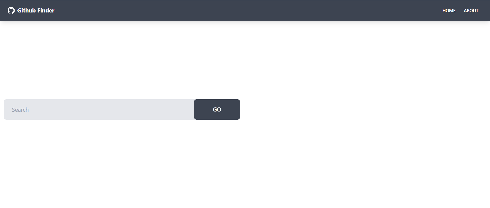

# Github Finder
This is a personal project I created where I integrate the Github API and use Context API as a state management tool.

## The Challenge
Users should be able to:
- View the optimal layout depending on the device's screen
- Search for user and get the result for that user
- Receive error message if they don't input anything into the input field
- Clear all the users

## Built With
- React.JS
- Github API
- Context API ( For state management )
- TailwindCSS and Daisy UI

## Screenshot

## Links
- Live site URL: https://stupendous-gumption-5059d8.netlify.app/